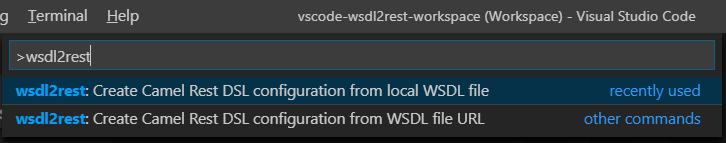

[]()
[](https://circleci.com/gh/camel-tooling/vscode-wsdl2rest)
[](https://sonarcloud.io/dashboard?id=vscode-wsdl2rest)
[]()
[](https://gitter.im/camel-tooling/Lobby)

# WSDL to Camel Rest DSL for Visual Studio Code
This preview release of the extension adds WSDL to REST support to [Visual Studio Code](https://code.visualstudio.com/).

 By specifying an existing WSDL file, you can use this extension to generate a Camel Rest DSL + CXF solution for REST-style access. The WSDL file can be located either on your local file system or from an accessible web URL.

Note: For this preview release, the **WSDL to Camel Rest DSL** extension creates Spring, Spring Boot, or Blueprint configurations. Java configurations are not supported yet.

## Contact Us
If you run into an issue or have a suggestion, you can report it by [creating a new issue on GitHub](https://github.com/camel-tooling/vscode-wsdl2rest/issues).

## How to install
You can download this **WSDL to Camel Rest DSL** extension from the Visual Studio Code Marketplace on its own or as part of the [Extension pack for Apache Camel by Red Hat](https://marketplace.visualstudio.com/items?itemName=camel-tooling.apache-camel-extension-pack or as its own) [wsdl2rest extension by Red Hat](https://marketplace.visualstudio.com/items?itemName=camel-tooling.vscode-wsdl2rest).

After you install VS Code, follow these steps:
1. In VS Code, select **View > Extensions**.
2. Search for **Camel**.
3. Select the **Extension Pack for Apache Camel** or the **WSDL to Camel Rest DSL** option and then click **Install**.

## Before you begin
Before you use this **WSDL to Camel Rest DSL** extension, you should create a mavenized Camel- or Fuse-based project, such as one of the following:

* A project that you create with the [Project Initializer by Red Hat VS Code extension](https://marketplace.visualstudio.com/items?itemName=redhat.project-initializer).   
Note: This extension is included in the [Extension pack for Apache Camel](https://marketplace.visualstudio.com/items?itemName=camel-tooling.apache-camel-extension-pack).

* A standalone Camel- or Fuse-based Spring project based on an existing example or a quickstart, for example:  
https://github.com/apache/camel/tree/master/examples/camel-example-spring  
or  
https://github.com/jboss-fuse/quickstarts/tree/master/beginner/camel-cbr

* A Maven project created by using [mvn:archetype](http://camel.apache.org/camel-maven-archetypes.html) with camel-archetype-spring, camel-archetype-blueprint, or camel-archetype-spring-boot.

After you create a project, you can then use the **WSDL to Camel Rest DSL** extension to generate the Camel Rest DSL + CXF solution for REST-style access. 

## Using the extension
To generate your Camel configuration from a WSDL file:

1. In VS Code, create a new workspace and then add the Camel- or Fuse-based project folder to the workspace.

2. Select **View > Command Palette** and then type **wsdl2rest**.  

      

3. Select whether to use a local WSDL file or a WSDL URL.

  * For a local WSDL file: In the File dialog that appears, browse to find the WSDL file in your local file system.
  
  * For a WSDL file URL: In the drop-down that appears, type the URL to the WSDL that you want to access.

4. Specify the DSL (Spring or Blueprint) for the generated Camel configuration.  

5. Specify the output directory for the generated CXF artifacts. The default directory is `src/main/java`.  
  
      **Important note:** You should change the output directory to a different folder if you do not want the extension to overwrite  existing classes with the same package or class name.

6. (Optional) Specify the address for the running JAX-WS endpoint. The default address is http://localhost:8080/somepath  
  
      **Note:** If you accept the default address and the WSDL file's `service/port` binding specifies a SOAP address location, then the generated Camel configuration uses that SOAP address instead of the default address.
  
7. (Optional) Specify the address for the generated JAX-RS endpoint. The default address is http://localhost:8081/jaxrs  

      The extension generates:
  * A Camel Rest configuration in your chosen DSL
  * The CXF artifacts to harness the power of your SOAP-based JAX-WS service in a RESTful way


8. Before you build or run the generated code, check the Maven configuration for your project and update it to include the following dependencies as needed:

### Spring- and Spring Boot-based projects

```xml
    <!-- wsdl2rest dependencies -->
    <dependency>
        <groupId>org.jboss.spec.javax.ws.rs</groupId>
        <artifactId>jboss-jaxrs-api_2.0_spec</artifactId>
        <version>1.0.0.Final-redhat-1</version>
    </dependency>
    <dependency>
        <groupId>org.apache.camel</groupId>
        <artifactId>camel-jackson</artifactId>
        <version>${camel.version}</version>
    </dependency>
    <dependency>
        <groupId>org.apache.camel</groupId>
        <artifactId>camel-cxf</artifactId>
        <version>${camel.version}</version>
    </dependency>
    <dependency>
        <groupId>org.apache.camel</groupId>
        <artifactId>camel-jetty</artifactId>
        <version>${camel.version}</version>
    </dependency>
```

### Blueprint-based projects

```xml
    <!-- wsdl2rest dependencies -->
    <dependency>
        <groupId>org.jboss.spec.javax.ws.rs</groupId>
        <artifactId>jboss-jaxrs-api_2.0_spec</artifactId>
        <version>1.0.0.Final-redhat-1</version>
    </dependency>
    <dependency>
        <groupId>org.apache.camel</groupId>
        <artifactId>camel-jackson</artifactId>
        <version>${camel.version}</version>
    </dependency>
    <dependency>
        <groupId>org.apache.camel</groupId>
        <artifactId>camel-cxf</artifactId>
        <version>${camel.version}</version>
    </dependency>
    <dependency>
        <groupId>org.apache.camel</groupId>
        <artifactId>camel-servlet</artifactId>
        <version>${camel.version}</version>
    </dependency>
```

