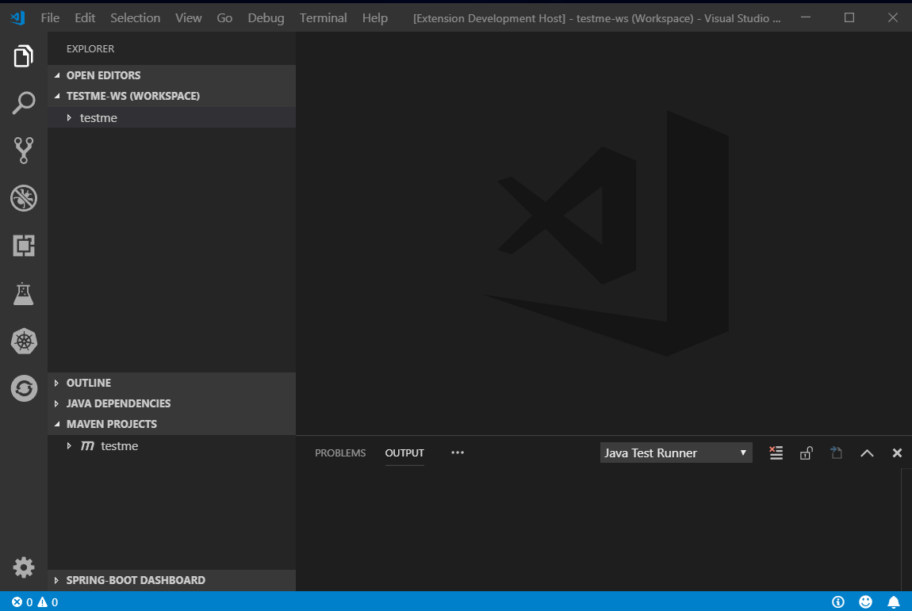

# wsdl2rest for Visual Studio Code
This preview release of the extension adds wsdl2rest support to [Visual Studio Code](https://code.visualstudio.com/) including:
* Support for taking an existing WSDL file for a working SOAP service and wrapping it in a Camel Rest DSL configuration for REST-style access.

Simple preview:

## Contact Us
If you run into any issues or have suggestions, please file [issues and suggestions on GitHub].

## How to install
(When) the wsdl2rest Extension is available from the [VSCode Marketplace].

* Install VS Code
* Open Extensions View (Ctrl+Shift+X)
* Search for "Camel"
* Select the "wsdl2rest" entry and click Install
* Enjoy!
